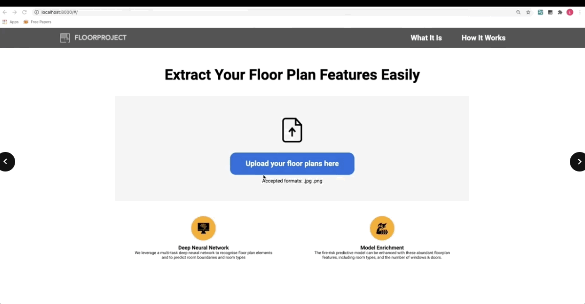

# DeepFloor: Floor Plan Recognition

In collaboration with Gemeente Amsterdam in 2020, this project aims to extract structured features from floor plan images to serve as inputs for their fire risk model. This core image recognition model originated from [DeepFloorplan](https://github.com/zlzeng/DeepFloorplan). We incorporated the model backbone and built a Django website for demonstration purposes.

## Demo


## How to Run the Demo

1. Install the required packages:
   ```
   pip install -r requirements/requirements_demo.txt
   ```

2. Download the [pretrained model](https://drive.google.com/drive/folders/1t6lDv82NXPGEUdZSu7gxjn2mg00JAwd9?usp=sharing) and place it in the `deepfloor/pretrained` folder.

3. Run the following command to start the server:
   ```
   python manage.py runserver
   ```